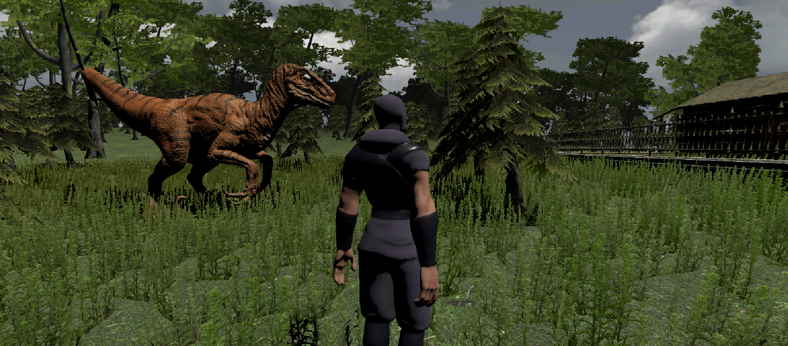
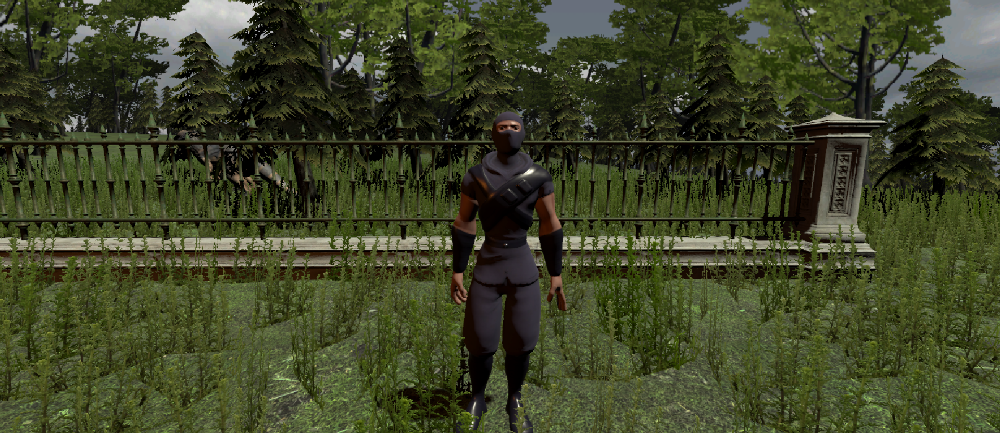
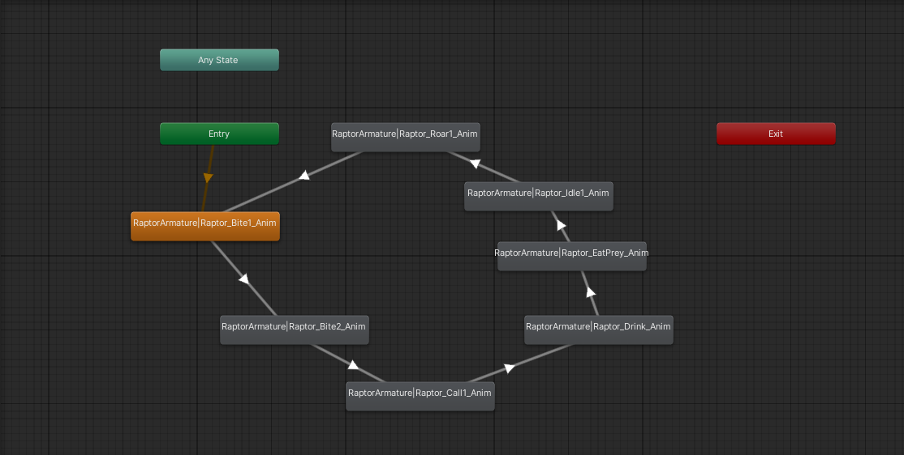
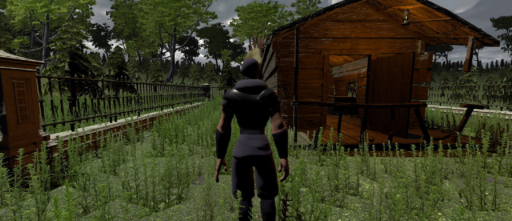

# Ninja Survival – 3D Animated Unity Project

A 3D animated Unity project set in a dark forest environment, featuring a controllable ninja character, animated dinosaurs, realistic terrain, lighting, and environment assets.

The project focuses on character animation, environment design, and third-person gameplay mechanics.

---

## Gameplay Preview

[▶ Watch Gameplay Video](https://drive.google.com/file/d/1jGcl_50DYpiFYOTi78Ny7ZLHLChM-Glv/view?usp=sharing)

---

## Screenshots

### Forest Environment


### Ninja Character


### Dinosaur Animation


### Wooden House Area


---

## Features

- Third-person ninja character movement
- Animated dinosaur behaviors
- Dark forest environment
- Realistic terrain and lighting
- Imported animations and prefabs
- Camera controls and interaction system

---

## Controls

| Key | Action |
|---|---|
| W A S D | Move |
| Mouse | Control Camera |
| Space | Jump |
| C | Crouch |
| Left Shift | Sprint |

---

## Technologies Used

- Unity
- C#
- Unity Animator
- Unity Terrain Tools
- Mixamo
- Adobe Photoshop
- Visual Studio

---

## How to Run

1. Install Unity Hub
2. Install Unity 2020.3 or newer
3. Clone or download this repository
4. Open the project using Unity Hub
5. Open the main scene
6. Press Play in Unity

---

## Project Structure

```text
Ninja-Survival/
├── Assets/
│   ├── Animations/
│   ├── Audio/
│   ├── Materials/
│   ├── Models/
│   ├── Prefabs/
│   ├── Scenes/
│   ├── Scripts/
│   ├── Shaders/
│   ├── Textures/
│   └── UI/
├── Packages/
├── ProjectSettings/
├── Screenshots/
└── README.md
```

---

## Development Process

The project was developed step by step, starting with learning the Unity interface and Animator system.

The environment was created using terrain tools, trees, lighting, and imported assets.

The main focus of the project was character animation and creating an immersive environment.

---

## Time Distribution

| Task | Time Spent |
|---|---|
| Learning Unity Basics | 20% |
| Concept and Planning | 10% |
| Asset Selection | 20% |
| Terrain & Environment | 25% |
| Character Animation | 25% |

---

## Challenges Faced

- Creating a custom character using free tools
- Asset compatibility between Unity versions
- Terrain creation difficulties
- Performance and lag issues
- Attempting NavMesh dinosaur AI

---

## Lessons Learned

- Unity fundamentals
- Asset importing
- Animator Controllers
- Materials and textures
- Rigidbody and Colliders
- Basic C# scripting
- Lighting and shaders
- Environment design workflow

---

## Assets Used

- Standard Assets
- Tree9
- Stone Fence
- Cabin Asset
- PBR Animated Dinosaurs
- Book of the Dead Environment
- ROWLAN Terrain Materials
- Mixamo Animations

---

## References

- https://assetstore.unity.com/
- https://www.mixamo.com/
- https://www.youtube.com/
- https://www.adobe.com/
- https://www.udemy.com/